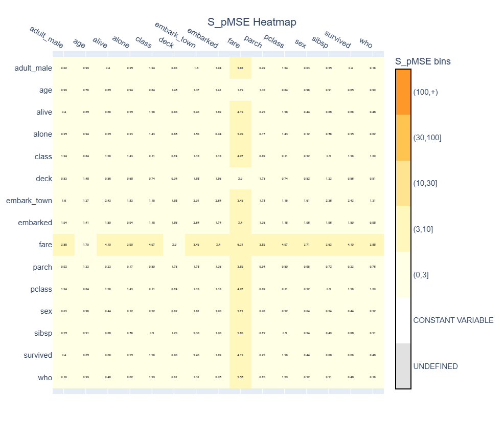
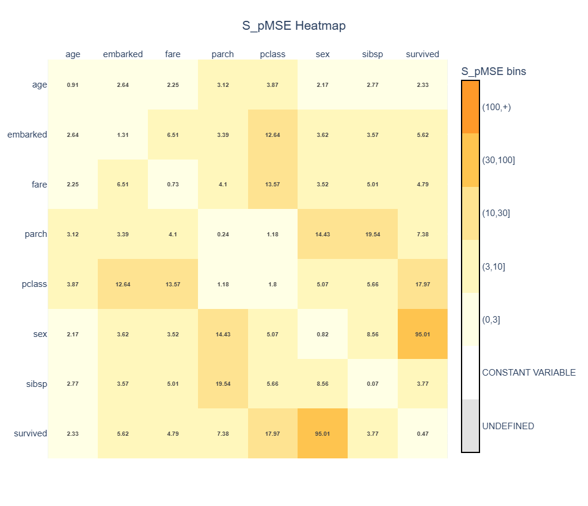

# Change the default synthesis method
In the previous examples, we changed several parameters of the {class}`~synthpop.synthesiser.Synthesiser`, such as the number of generated rows (`n`) and the synthesis order (`column_order`). However, the `Synthesiser` also allows you to control what synthesis method is used.

By default, synthpop-py uses the {class}`~synthpop.methods.cart_synth.CartMethod`. CART is a flexible method that models relationships between variables by using previously synthesised variables as predictors.

However, not every dataset requires the same synthesis strategy for every situation. For some variables, a simpler approach may be sufficient. For example, you may only want to reproduce the distribution of a variable without preserving relationships.

In this example, we will explore how to change the `default_syn_method` parameter of the {class}`~synthpop.synthesiser.Synthesiser`.

For a complete overview of available synthesis methods, see [User Guide 3: Synthesis methods](../user_guides/3_synthesis_methods.md).

## Load the data
We start with the Titanic dataset that was also used in the previous examples. It contains both numerical and categorical variables, which allows us to see how different synthesis methods handle different types of data. For simplicity, we keep only 8 variables:
```python
import seaborn as sns

data = sns.load_dataset("titanic")

data = data[
    [
        "survived",
        "pclass",
        "sex",
        "age",
        "sibsp",
        "parch",
        "fare",
        "embarked",
    ]
]

data.head(3)
```
The first three rows are:
|    |   survived |   pclass | sex    |   age |   sibsp |   parch |    fare | embarked   
|---:|-----------:|---------:|:-------|------:|--------:|--------:|--------:|:-----------|
|  0 |          0 |        3 | male   |    22 |       1 |       0 |  7.25   | S          |
|  1 |          1 |        1 | female |    38 |       1 |       0 | 71.2833 | C          |
|  2 |          1 |        3 | female |    26 |       0 |       0 |  7.925  | S          |


## Use the default CART synthesis method
The default synthesis method of synthpop-py is CART. Therefore, the following `Synthesiser` uses CART automatically:
```python
from synthpop import Synthesiser

cart_synthesiser = Synthesiser(random_seed=1)

cart_synthesiser.fit(data)

synthetic_cart = cart_synthesiser.generate()
```
No `default_syn_method` was specified, so the `Synthesiser` automatically uses:
```python
from synthpop.methods import CartMethod

default_syn_method=CartMethod()
```
We used the default column order,  which you can see in the code where we specified which 8 variables we use. CART does not require predictors for the first variable in the synthesis order, so the first column is sampled from its observed distribution.

For each following column, CART uses the previously synthesised variables as predictors to model the conditional distribution of that variable. This means that generated values are not sampled independently: later columns depend on the relationships learned from the original dataset. For example, when synthesising `sex`, the method uses the previously generated variables, `survived` and `pclass`, as predictors.

More information about CART synthesis can be found in {ref}`User Guide 3.1: CART synthesis method <31-cart-synthesis>`.

## Change the default method to Sample
Sometimes it is useful to synthesise variables without modelling its relationships with other variables. The {class}`~synthpop.methods.sample_synth.SampleMethod` samples values directly from the observed marginal distribution of each variable. It does not use predictors and therefore does not explicitly preserve relationships between variables.

Unlike CART, where only the first column is sampled independently and later columns are conditioned on previously synthesised variables, `SampleMethod` generates every column independently from its own observed distribution.

Because it does not fit predictive models, `SampleMethod` is computationally less expensive than CART. This can make it useful for large datasets or for variables where modelling relationships provides limited additional value.

In practice, `SampleMethod` is often used at the beginning of a synthesis process when some variables should be generated first without creating combinations of values that do not exist in the original data. For example, sampling initial variables independently can help prevent later synthesis steps from conditioning on unrealistic combinations. It can also be useful when a variable has very weak relationships with the rest of the dataset and a CART model is unlikely to provide additional benefit.

However, `SampleMethod` should not generally be preferred over CART when relationships between variables are important. Since relationships are not modelled, important associations between variables may not be preserved. Additionally, because values are sampled directly from observed distributions, privacy protection may be weaker in some situations, particularly for variables containing rare or distinctive values.

We can use it as the default synthesis method by passing it to `default_syn_method`.
```python
from synthpop.methods import SampleMethod

sample_synthesiser = Synthesiser(
    random_seed=1,
    default_syn_method=SampleMethod()
)

sample_synthesiser.fit(data)

synthetic_sample = sample_synthesiser.generate()
```
The generated dataset has the same variables as the original dataset, but the synthesis process is different. Each column is generated independently based only on its own distribution.

For example, the original Titanic dataset contains relationships such as:
- `pclass` (passenger class) being related to `fare`;
- `sex` being related to `survived`;
- `pclass` being related to `survived`.

These relationships are not explicitly modelled by `SampleMethod`.

More information about sampling synthesis can be found in {ref}`User Guide 3.2: Sample synthesis method <32-sample-synthesis>`.

## Compare the synthesis methods
The difference between CART and Sample Synthesis becomes visible when comparing their utility.

For example, we can calculate the pairwise S_pMSE:
```python
from synthpop.utility_metrics import pairwise_spmse
from synthpop.plotting import plot_spmse

spmse_cart = pairwise_spmse(
    orig_df=data,
    syn_df=synthetic_cart,
)

plot_cart = plot_spmse(spmse_cart, show_plot=True)
```

```python
spmse_sample = pairwise_spmse(
    orig_df=data,
    syn_df=synthetic_sample,
)

plot_sample = plot_spmse(spmse_sample, show_plot=True)
```


As you can see in the plots, CART generally produces lower S_pMSE values because it attempts to preserve relationships between variables.

Sample synthesis can reproduce individual distribution well, which you can check using {func}`~synthpop.plotting.plot_univariate_distributions`. However, relationships between variables will often have large differences because variables are generated independently.

This illustrates an important choice in synthetic data generation:
- **CART** preserves relationships between variables.
- **Sample** preserves individual distributions but not relationships between variables.

The appropriate method depends on the intended use of the synthetic dataset.

## Copy synthesis method
Another available synthesis method is {class}`~synthpop.methods.copy_synth.CopyMethod`. Unlike CART and Sample, this method does not generate new values. Instead, it reproduces the original values exactly.

For example:
```python
from synthpop.methods import CopyMethod
```
could be used for variables that act as fixed identifiers or structural fields that must remain unchanged. A possible example is an internal record identifier that is required for linking synthetic data with another system.

However, `CopyMethod` should be used carefully because copied values are directly taken from the original dataset. It does **not** provide privacy protection for that variable. It should never be used as the `default_syn_method`.

Additionally, because values are copied directly, it cannot generate more rows than the original dataset.

We will use `CopyMethod` in the next example where different synthesis methods are assigned to different columns. More information about CART synthesis can be found in {ref}`User Guide 3.3: Copy synthesis method <33-copy-synthesis>`.

## Next steps
Changing the default synthesis method applies the same synthesis strategy to every column. However, in practice, different variables may require different approaches.

For example:
- a sensitive continuous variable may benefit from CART;
- a simple categorical variable may only require sampling;
- a structural variable may need to be copied exactly.

In the next example, we will combine different synthesis methods within the same dataset by using the `special_syn_method` parameter. This allows each column to use the synthesis method that best fits its purpose.