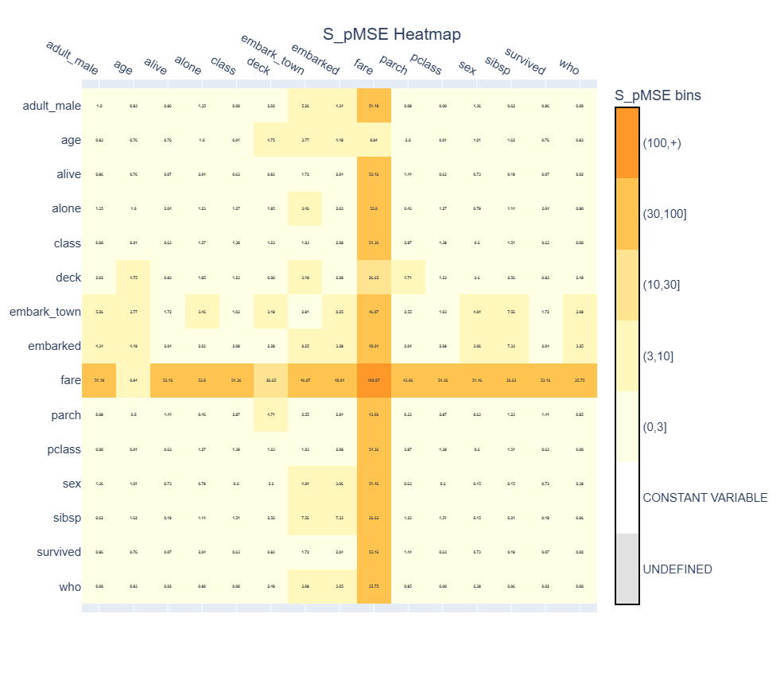
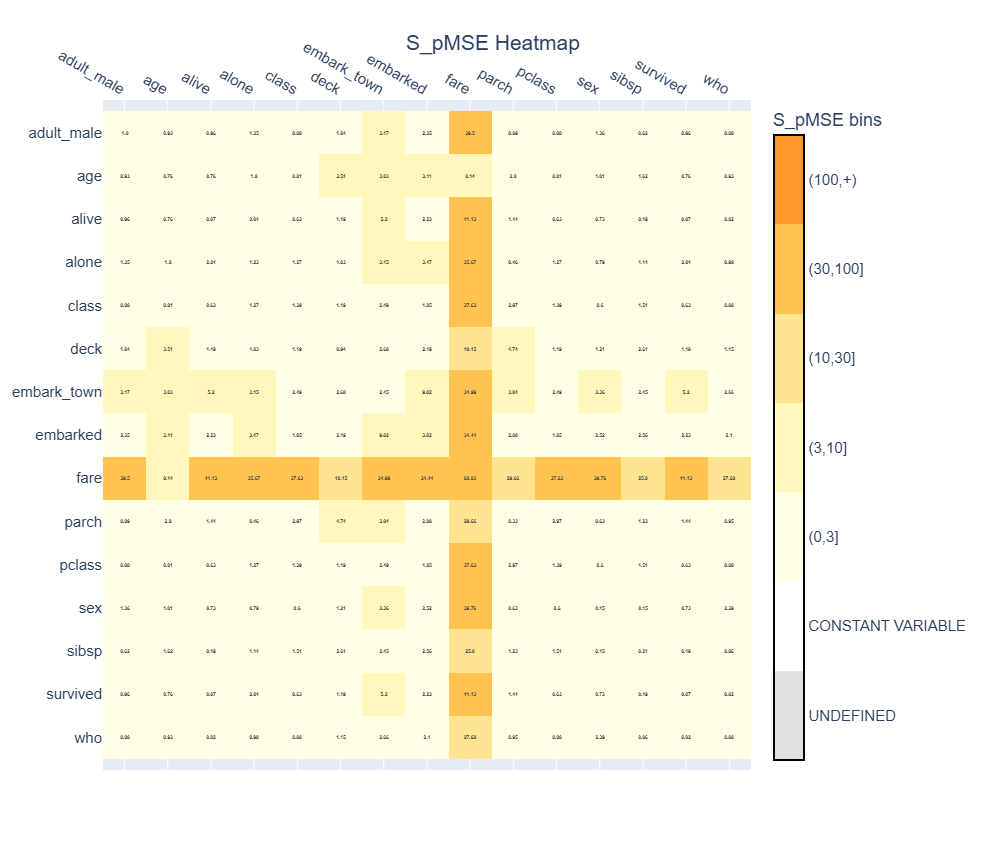
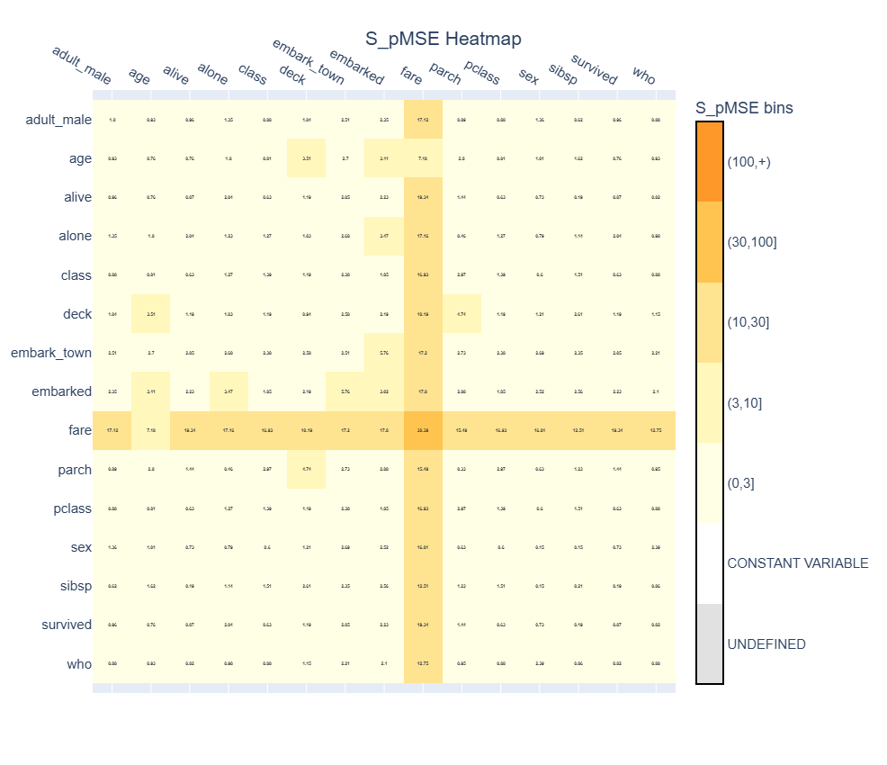

# Change the synthesis order

In the previous example, we generated a synthetic version of the Titanic dataset containing 5000 observations.

When evaluating the synthetic data using the S_pMSE heatmap, you may have noticed that some relationships between variables were better preserved than others.

```{note}
Reminder: the S_pMSE is influenced by the number of observations in the original and synthetic datasets. Generating more synthetic rows may result in larger S_pMSE values, even if the underlying quality of the synthesis has not changed, because small differences can be estimated more precisely. Therefore, S_pMSE values are most meaningful when comparing synthesis methods or parameter settings on datasets of the same size.
```

Although the univariate distributions closely matched those of the original dataset, the S_pMSE heatmap tells a different story. Most relationships are preserved well, but the pairwise relationships involving `fare` have substantially larger S_pMSE values than the others. This suggests that relationships involving `fare` are not being reproduced as well as desired.

This does not necessarily mean that the synthesiser performed poorly. Instead, it suggests that the default synthesis settings are not optimal for this dataset.

One of the most effective ways to improve the preservation of relationships is to change the **synthesis order**.

Because synthpop-py generates one variable at a time, each variable is modelled using the variables that have already been synthesised. Choosing a more appropriate synthesis order can therefore improve the quality of the generated synthetic data.

In this example, we will change the synthesis order and compare the resulting S_pMSE values with those from the previous example.

## The default synthesis order

By default, variables are synthesised in the same order as they appear in the DataFrame.

```python
data.columns
```

```text
Index([
    'survived',
    'pclass',
    'sex',
    'age',
    'sibsp',
    'parch',
    'fare',
    'embarked',
    'class',
    'who',
    'adult_male',
    'deck',
    'embark_town',
    'alive',
    'alone',
    ], dtype='str')
```

If the synthesiser is created with the default parameters, no `column_order` is specified and the original column order is used.

```python
from synthpop import Synthesiser

synthesiser = Synthesiser(random_seed=1)
```

## Why does the synthesis order matter?

synthpop-py generates variables **sequentially**.

The first variable is synthesised without predictors. In the default synthesis method, the first variable is sampled. The second variable is synthesised using the first synthetic variable as a predictor. The third variable uses the first two synthetic variables, and so on.

For example, with the default order,

```{mermaid}
flowchart TB
    A["survived"]
    B["pclass"]
    C["sex"]
    D["age"]
    E["sibsp"]
    F["parch"]
    G["fare"]
    H["embarked"]
    I["class"]
    J["who"]
    K["adult_male"]
    L["deck"]
    M["embark_town"]
    N["alive"]
    O["alone"]

    A-->B-->C-->D-->E-->F-->G-->H-->I-->J-->K-->L-->M-->N-->O
```

the model for `alone` can use all fourteen measurements as predictors. However, the model for `alive` cannot use `alone`, because `alone` has not yet been synthesised. Every variable can only use the variables before it in the synthesis order as predictors. Variables generated later therefore have access to more information than variables generated earlier.

A good synthesis order often allows variables that are difficult to synthesise to use as many informative predictors as possible. One way to identify such variables is to inspect the S_pMSE heatmap. Variables that consistently appear in pairwise relationships with large S_pMSE values may benefit from being moved later in the synthesis order.

There is no synthesis order that is optimal for all datasets. The best order depends on the structure of the dataset and the relationships between variables. In practice, changing the synthesis order and comparing utility metrics such as S_pMSE can help determine whether the chosen order better preserves important relationships.

More information about the sequential synthesis procedure is available in [User Guide 2: Synthetic data generation](../user_guides/2_synthetic_data_generation.md).

## Choose a different order

Looking at the original S_pMSE heatmap, many of the largest values involve `fare`. For example, the relationships between `fare` and `survived`, `pclass`, `class`, `adult_male` and `alone` all have considerably larger S_pMSE values than most other pairs.

A simple strategy is therefore to move `fare` to the end of the synthesis order. Since variables are synthesised sequentially, moving `fare` to the end of the synthesis order allows its synthesis model to use all other variables as predictors. This additional information may help preserve relationships involving `fare`.

We can specify the synthesis order using the `column_order` parameter.

```python
synthesiser = Synthesiser(
    random_seed=1,
    column_order=[
        "survived",
        "pclass",
        "sex",
        "age",
        "sibsp",
        "parch",
        "embarked",
        "class",
        "who",
        "adult_male",
        "deck",
        "embark_town",
        "alive",
        "alone",
        "fare",
    ],
)

synthesiser.fit(data)

synthetic_data_new = synthesiser.generate(n=5000)
```

Instead of variable names, the synthesis order can also be specified using column indices:

```python
synthesiser = Synthesiser(
    random_seed=1,
    column_order=[0, 1, 2, 3, 4, 5, 7, 8, 9, 10, 11, 12, 13, 14, 6],
)
```

Both approaches produce the same synthesis order.

## Evaluate the new synthesis order

After changing the synthesis order, we now calculate the S_pMSE values again.

```python
from synthpop.utility_metrics import pairwise_spmse
from synthpop.plotting import plot_spmse

spmse_new = pairwise_spmse(data, synthetic_data_new)

plot_new = plot_spmse(spmse_new, show_plot=True)
```


The new heatmap shows that changing the synthesis order improved several relationships involving `fare`. For example, the S_pMSE value between `fare` and `survived` decreased from approximately 53 to 41, while the relationship between `fare` and `pclass` decreases from approximately 54 to 37.

The improvement is encouraging, but `fare` is still involved in many of the largest S_pMSE values. In addition, the updated heatmap reveals that some relationships involving `embark_town` are now less preserved.

This illustrates an important point: changing the synthesis order is rarely a one-shot optimisation. Instead, it is often useful to make a small change, evaluate the result, and then decide on the next refinement.

## Try another synthesis order
For the next step, we see what happens if we move `embark_town` to the end of the synthesis order as well. Since `fare` has already been moved, we place `embark_town` after `fare`, allowing it to use every other variable, including `fare`, as predictors.
```python
synthesiser = Synthesiser(
    random_seed=1,
    column_order=[
        'survived',
        'pclass',
        'sex',
        'age',
        'sibsp',
        'parch',
        'embarked',
        'class',
        'who',
        'adult_male',
        'deck',
        'alive',
        'alone',
        'fare',
        'embark_town',
    ],
)

synthesiser.fit(data)

synthetic_data_final = synthesiser.generate(n=5000)

spmse_final = pairwise_spmse(data, synthetic_data_final)

plot_final = plot_spmse(spmse_final, show_plot=True)
```

The resulting heatmap shows another improvement. All relationships involving `embark_town` are better preserved. 

Interestingly, moving `embark_town` after `fare` also improves the relationships involving `fare`. For example, the S_pMSE value for the relationship between `fare` and `survived` originally was approximately 53 and is now 19. For `fare` and `pclass` it was 54 and now is 17. This suggests that using `embark_town` as a predictor for `fare` was not beneficial for this dataset. More generally, adding predictors does not always improve a synthesis model. Variables that contain little useful information or introduce additional noise can sometimes reduce synthesis quality.

While there is still room for improvement, this example has demonstrated how changing the synthesis order can make a big impact on the quality of the synthesis. Rather than searching for a perfect synthesis order from the outset, it is often more effective to refine the order iteratively: inspect the utility metrics, identify variables involved in poorly preserved relationships, adjust the order, and evaluate again.

## When should you change the synthesis order?

The Titanic example demonstrates one practical approach: use the S_pMSE heatmap to identify variables involved in poorly preserved relationships and iteratively adjust the synthesis order. However, utility metrics are not the only source of information.

Changing the synthesis order is most useful when:

- some variables explain many other variables;
- you observe poor preservation of important relationships;
- you have domain knowledge about causal or predictive relationships between variables.

For many datasets, the default column order provides satisfactory results. However, adjusting the synthesis order is often one of the simplest ways to improve utility. As seen in this example, a good synthesis order allows variables that are difficult to synthesise to use as many informative predictors as possible. Utility metrics such as S_pMSE can help identify these variables, but other characteristics can also influence an appropriate order. See the {ref}`User Guide <224-column-order>` for more information about changing the synthesis order.

## Next steps

Changing the synthesis order affects **which predictors are available** during synthesis. Another way to improve utility is to change **how individual variables are synthesised**.

In the next examples, we will learn how to change more parameters, select different synthesis methods for individual variables and customise the synthesis process further.
