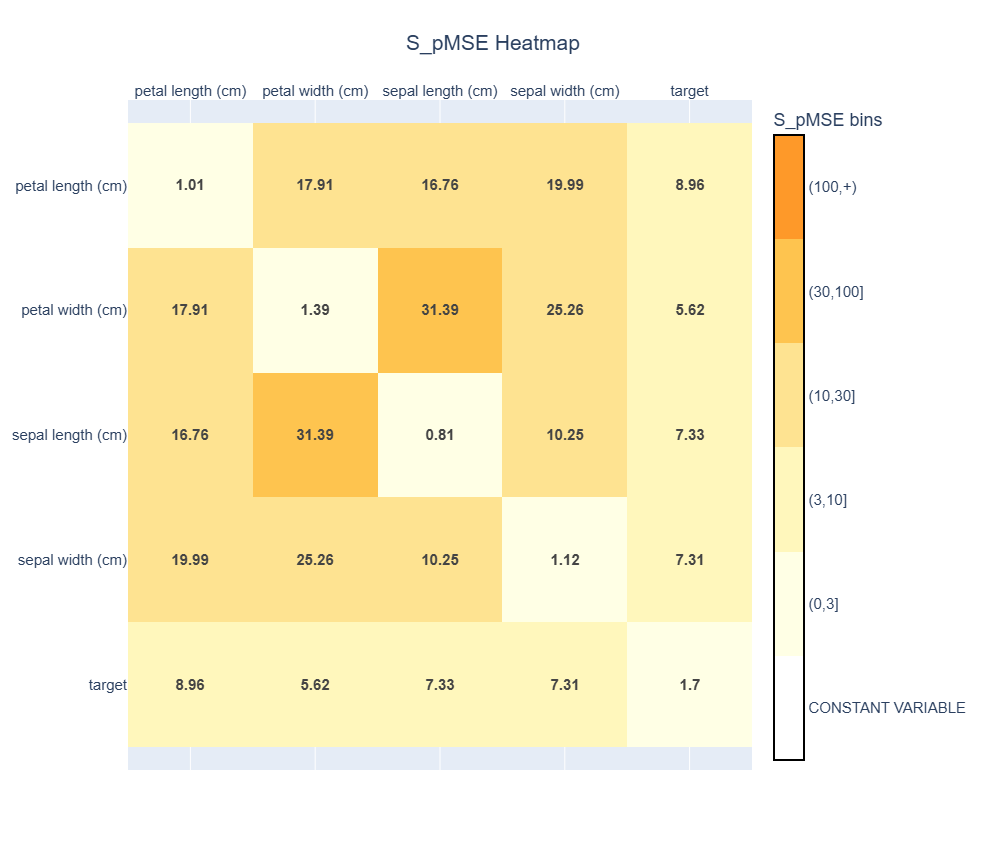
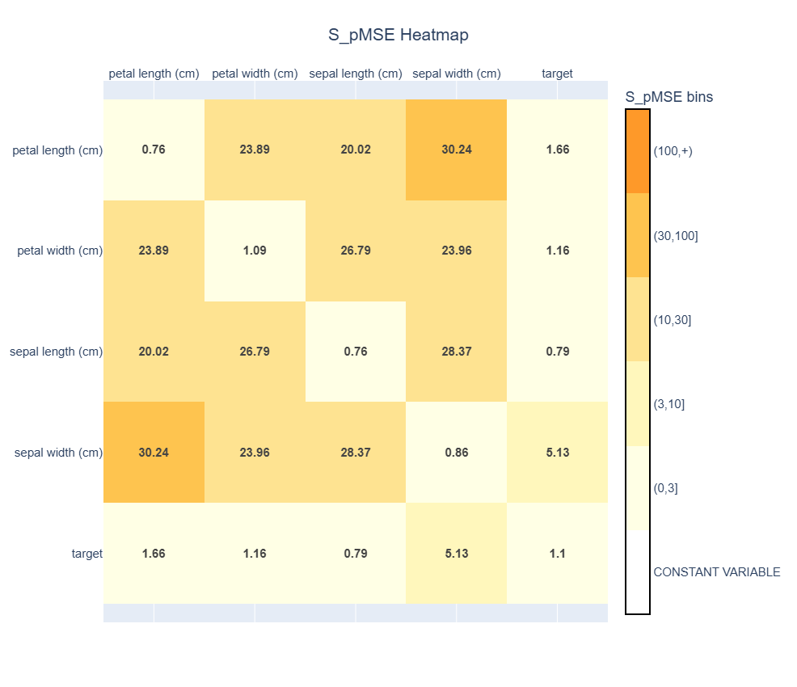

# Changing the synthesis order
In the previous example, we generated a synthetic version of the Iris dataset containing 5000 observations. When evaluating the synthetic data using the S_pMSE heatmap, you may have noticed that some relationships between variables were not preserved as well as others.


Although the univariate distributions closely matched those of the original dataset, the S_pMSE heatmap tells a different story. Several pairwise relationships have relatively large S_pMSE values, indicating that these relationships are not preserved as well in the synthetic data. For example, the relationships involving `petal width (cm)` have S_pMSE values greater than 30, while several others fall between 10 and 30.

This does not necessarily mean that the synthesiser performed poorly. Instead, it suggests that the default synthesis settings are not optimal for this dataset.

One of the most effective ways to improve the preservation of relationships is to change the **synthesis order**.

Because synthpop-py generates one variable at a time, each variable is modelled using the variables that have already been synthesised. Choosing a more appropriate synthesis order can therefore improve the quality of the generated synthetic data.

In this example, we will change the synthesis order and compare the resulting S_pMSE values with those from the previous example.

## The default synthesis order
By default, variables are synthesised in the same order as they appear in the DataFrame.
```python
data.columns
```
```text
Index([
    'sepal length (cm)', 
    'sepal width (cm)', 
    'petal length (cm)',               
    'petal width (cm)', 
    'target'
    ],                                              
      dtype='str')
```
This is equivalent to creating the synthesiser as:
```python
from synthpop.synthesiser import Synthesiser

synthesiser = Synthesiser(random_seed=1)
```
No `column_order` is specified, so the original column order is used.

## Why does the synthesis order matter?
synthpop-py generates variables **sequentially**.

The first variable is synthesised without predictors. In the default synthesis method, the first variable is sampled. The second variable is synthesised using the first synthetic variable as a predictor. The third variable uses the first two synthetic variables, and so on.

For example, with the default order,
```{mermaid}
flowchart TB
    A["sepal length (cm)"]
    B["sepal width (cm)"]
    C["petal length (cm)"]
    D["petal width (cm)"]
    E["target"]
    A-->B-->C-->D-->E
```
the model for `target` can use all four measurements as predictors. However, the model for `petal width (cm)` cannot use `target`, because `target` has not yet been synthesised.

A good synthesis order generally places variables that contain important information about other variables earlier in the sequence. This allows later variables to be generated conditional on these important predictors, helping preserve relationships in the data.

However, predictive strength is not the only consideration when choosing an order. Other characteristics of variables can also influence the quality of synthesis:

- **Variables that strongly explain other variables** are often useful to place early. For example, in the Iris dataset, the species (`target`) largely determines the distributions of petal measurements. Generating the target first allows petal variables to be generated conditional on species.
- **Variables with many missing values** may provide less reliable information as predictors. Placing these variables later prevents incomplete information from being used to generate many other variables.
- **Variables with many rare categories** can introduce uncertainty when used as predictors. Generating these variables later can reduce the propagation of errors.
- **Variables that represent outcomes or summaries** are often better placed later because they can use information from the variables that contribute to them.

There is no universally optimal synthesis order. The best order depends on the structure of the dataset and the relationships between variables. In practice, changing the synthesis order and comparing utility metrics such as S_pMSE can help determine whether the chosen order better preserves important relationships.

More information about the sequential synthesis procedure is available in User Guide ADD LINK.

## Choosing a different order
As shown by the S_pMSE heatmap above, several pairwise relationships were not preserved well. In particular, the relationships involving the petal measurements and the target variable have relatively high S_pMSE values. This indicates that the synthetic dataset does not reproduce these relationships as well as desired.

For the Iris dataset, the `target` variable represents the iris species. This variable strongly determines the distributions of the other measurements, especially the petal measurements. For example, different species have clearly different petal length and petal width distributions. However, in the default synthesis order, the target variable is generated last, meaning that the other variables are synthesised without using species information.

To improve the preservation of these relationships, we change the synthesis order so that the target variable is generated first. We also place the petal measurements directly after the target variable, allowing them to be generated conditional on species. The sepal measurements are placed later because they have weaker relationships with the target variable and can benefit from having the petal measurements available as predictors.

We can specify the synthesis order using the `column_order` parameter.
```python
synthesiser = Synthesiser(
    random_seed=1,
    column_order=[
        "target",
        "petal length (cm)",
        "petal width (cm)",
        "sepal length (cm)",
        "sepal width (cm)",
    ],
)

synthesiser.fit(data)

synthetic_data_new = synthesiser.generate(n=5000)
```
Instead of variable names, the synthesis order can also be specified using column indices:
```python
synthesiser = Synthesiser(
    random_seed=1,
    column_order=[4, 2, 3, 0, 1],
)
```
Both approaches produce the same synthesis order.

## Evaluating the new synthesis order
After changing the synthesis order, we generate a new synthetic dataset and calculate the S_pMSE values again.
```python
from synthpop.utility_metrics.spmse import pairwise_spmse
from synthpop.plotting import plot_spmse

spmse_new = pairwise_spmse(data, synthetic_data_new)

plot_spmse(spmse_new)
```

The new heatmap shows that changing the synthesis order improved several important relationships. In particular, the relationships between the target variable and the petal measurements have much lower S_pMSE values compared with the original synthesis order.

This improvement is expected because the target variable represents the iris species, which strongly determines the distributions of the petal measurements. By generating the target first, the petal measurements can now be generated conditional on species.

However, the new synthesis order does not improve every relationship. Some relationships between sepal variables have higher S_pMSE values than before. This illustrates that there is no universally optimal synthesis order: changing the order changes which variables are available as predictors during each synthesis step.

When choosing a synthesis order, it is therefore important to consider the structure of the dataset and the relationships that are most important for the intended use case. Utility metrics such as S_pMSE can help compare different choices.

## When should you change the synthesis order?
Changing the synthesis order is most useful when:
- some variables explain many other variables;
- you observe poor preservation of important relationships;
- you have domain knowledge about casual or predictive relationships between variables.

For many datasets, the default column order may provide satisfactory results. However, adjusting the synthesis order is often one of the simplest ways to improve utility.

## Next steps
Changing the synthesis order affects **which predictors are available** during synthesis. Another way to improve utility is to change **how individual variables are synthesised**.

In the next examples, we will learn how to change more parameters, select different synthesis methods for individual variables and customise the synthesis process further.
