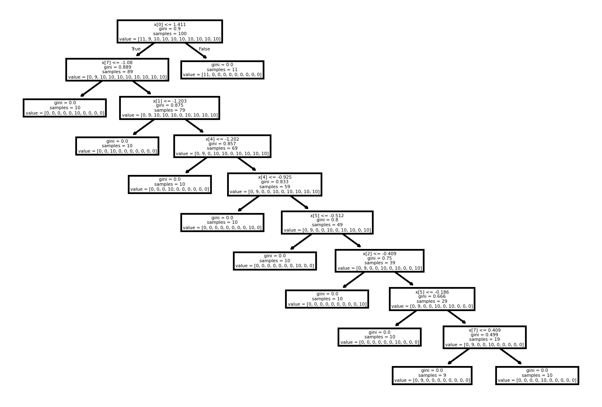

# Risk of privacy loss due to rare categories

When dealing with categorical data where some categories have very few observations, so called rare categories, there is a risk of disclosing more information than intended about small groups.
The following example demonstrates how rare or unique categorical values can cause overfitting, potentially increasing disclosure risk

The example uses a decision-tree-based synthesis method with a categorical predictor containing a unique value for every observation. Because the predictor uniquely identifies each observation, the decision tree can create homogeneous leaf nodes where all observations have the same target value. Sampling from these leaf nodes introduces little or no randomness because all possible sampled values are identical, causing the synthetic target values to reproduce the original target values.

This example is intentionally constructed to demonstrate a potential failure mode. It does not imply that decision-tree-based synthesis methods will generally reproduce target variables exactly. Rather, it illustrates why the structure and cardinality of the input data should be considered when evaluating privacy.

Although this example is deliberately constructed, similar situations can occur when floating-point data is unintentionally converted to strings.

## Demonstration of the problem

Suppose the following happens:


```python
import warnings
import pandas as pd
from sklearn.datasets import make_classification
from synthpop.utils import str_dtype
warnings.filterwarnings('ignore')

X, y = make_classification(
    random_state=42,
    n_samples=100,
    n_classes=10,
    n_informative=11,
)
# The floating-point numbers are unintentionally cast to strings.
# As a result, The data will be categorical and every value unique.
X = X[:, 0:1].astype(str_dtype)
X[0:3]
```


    array([['1.3705361439967134'],
           ['-0.1115088271429437'],
           ['1.0587285298838789']], dtype=StringDType(na_object=nan))


Because we 'accidentally' cast the numerical array to strings, the predictor column is now categorical with unique values.

We can use a decision-tree-based synthesis method to synthesise the target:


```python
from synthpop.methods.cart_synth import TreeClassifierMethod
method = TreeClassifierMethod()

X = {i: X[:, i] for i in range(X.shape[1])}
y = y.astype(str_dtype)
synth_data = method.fit_transform(X, y)
print(y)
```


    array(['4', '0', '5', '1', '0', '1', '7', '6', '4', '4', '8', '0', '3',
           '0', '0', '6', '3', '7', '3', '0', '8', '6', '5', '9', '2', '0',
           '5', '6', '3', '3', '7', '7', '6', '6', '9', '2', '6', '8', '9',
           '7', '3', '9', '8', '1', '2', '5', '3', '9', '4', '2', '3', '5',
           '4', '9', '0', '7', '3', '0', '1', '4', '5', '2', '8', '6', '1',
           '3', '7', '8', '8', '7', '8', '9', '4', '9', '9', '4', '1', '7',
           '2', '4', '7', '0', '1', '1', '9', '6', '5', '5', '2', '2', '6',
           '8', '5', '1', '5', '2', '0', '8', '2', '4'],
          dtype=StringDType(na_object=nan))


In this example, the synthesised target is identical to the original target:


```python
(synth_data == y).all()
```


    np.True_


## Why does this happen?

This occurs because the predictor data is unique. As such, the decision tree is able to partition the observations into homogeneous leaf nodes. Each leaf contains observations with the same target value, so sampling a target value from a leaf does not introduce uncertainty because all values in the leaf are identical.

The resulting tree illustrates this behaviour:


```python
from sklearn import tree
from matplotlib import pyplot as plt
plt.figure(figsize=(6, 4), dpi=300)
tree.plot_tree(method.tree_)
plt.show()
```


    

    


Because the predictor contains 100 different values and the target contains only 10 possible values, the tree can separate observations into groups that are homogeneous with respect to the target. The synthesis model has captured the relationship between the predictor and target too precisely for this dataset.

This is an example of [overfitting](https://en.wikipedia.org/wiki/Overfitting) in the sense that the model has captured a highly specific relationship present in the training data rather than a generalisable pattern. In this case, the consequence of overfitting is a potential privacy risk: the synthesis process reproduces a relationship in the original data without introducing sufficient uncertainty.

A similar issue can occur in realistic datasets when a variable contains rare categories that are strongly associated with a sensitive variable.

For example, suppose you have a dataset about traffic safety for employees of a company. The first column indicates the mode of transportation to work. The second column is how many sick leaves the employee had, which is sensitive information. While most employees come to work by public transit, bike, or foot, there are 2 employees that go to work on a trike. The value "trike" is a rare category for the first column. The synthetic dataset would reveal the exact amount of sick leave for the employees going to work by trike. So, in this scenario, if you have this synthetic dataset, and know that your coworker comes to work by trike, you can infer something about their health. 

As such, if the synthesis model reproduces this relationship exactly, a third party with knowledge of the rare category may be able to infer the sensitive characteristic from the synthetic data.


### The impact of this problem

The previous example demonstrates the mechanism by which overfitting can lead to [attribute disclosure](../user_guides/6_evaluating_privacy.md#attribute-disclosure). However, it is deliberately constructed: the same predictor values are used both to fit the synthesis model and to demonstrate the resulting disclosure. In a typical sequential synthesis workflow, the predictors itself are synthesised, so the exact predictor values from the original dataset will not necessarily appear in the synthetic dataset.

Nevertheless, the same privacy risk can occur in realistic settings when rare or unique categories are present in the data. If a rare category is reproduced in the synthetic dataset and a synthesis model has learned a strong relationship between that category and a sensitive variable, the sensitive value associated with the category may also be reproduced too accurately.

The risk is particularly evident when a variable is intentionally copied using {class}`~synthpop.methods.copy_synth.CopyMethod`. Consider the following dataset:


```python
import pandas as pd

df = pd.DataFrame({'X': X[0], 'y': y})
df['y'] = y
df
```


<div>
<style scoped>
    .dataframe tbody tr th:only-of-type {
        vertical-align: middle;
    }

    .dataframe tbody tr th {
        vertical-align: top;
    }

    .dataframe thead th {
        text-align: right;
    }
</style>
<table border="1" class="dataframe">
  <thead>
    <tr style="text-align: right;">
      <th></th>
      <th>X</th>
      <th>y</th>
    </tr>
  </thead>
  <tbody>
    <tr>
      <th>0</th>
      <td>1.3705361439967134</td>
      <td>4</td>
    </tr>
    <tr>
      <th>1</th>
      <td>-0.1115088271429437</td>
      <td>0</td>
    </tr>
    <tr>
      <th>2</th>
      <td>1.0587285298838789</td>
      <td>5</td>
    </tr>
    <tr>
      <th>3</th>
      <td>1.0706105599791862</td>
      <td>1</td>
    </tr>
    <tr>
      <th>4</th>
      <td>-1.1617838439123638</td>
      <td>0</td>
    </tr>
    <tr>
      <th>...</th>
      <td>...</td>
      <td>...</td>
    </tr>
    <tr>
      <th>95</th>
      <td>-0.5336003064391669</td>
      <td>2</td>
    </tr>
    <tr>
      <th>96</th>
      <td>-1.2926253471522626</td>
      <td>0</td>
    </tr>
    <tr>
      <th>97</th>
      <td>-0.16563141031763223</td>
      <td>8</td>
    </tr>
    <tr>
      <th>98</th>
      <td>0.04522270899998256</td>
      <td>2</td>
    </tr>
    <tr>
      <th>99</th>
      <td>-1.066234931899225</td>
      <td>4</td>
    </tr>
  </tbody>
</table>
<p>100 rows × 2 columns</p>
</div>


Here, `X` is a categorical variable with a unique value for every observation, while `y` is the target variable. If `X` is copied exactly and `y` is synthesised using an overfitted model, the relationship between `X` and `y` can be reproduced exactly:


```python
from synthpop.synthesiser import Synthesiser
from synthpop.methods.copy_synth import CopyMethod
synth = Synthesiser(
    random_seed=2,
    special_syn_method={"X": CopyMethod()}
)

synth.fit(df)
syn_df = synth.generate()

syn_df["y"].equals(df["y"])
```


    True


This is an intentionally extreme example. `CopyMethod` reproduces the values of `X` exactly, and the overfitted `CartMethod` can then reproduce the corresponding values of `y` in the synthetic dataset. The result is that the complete observed dataset is reproduced in the synthetic data, which provides no meaningful privacy protection.

In practice, users should therefore take particular care when using `CopyMethod` for variables that contain rare, unique or identifying values. Copying such variables can preserve the link between those values and other variables in the dataset, including sensitive attributes. Even when the complete dataset is not reproduced, preserving these relationships too accurately can result in attribute disclosure.

However, the risk is not specific to `CopyMethod`. The example uses `CopyMethod` to make the privacy risk particularly clear by ensuring that the rare or unique values are present in the synthetic data. The same underlying risk can occur with the default CART-based synthesis methods. If a rare category is generated in the synthetic data and the CART model has overfitted the relationship between that category and a sensitive variable, the corresponding sensitive value may also be reproduced with high probability. In this situation, the synthetic dataset does not need to reproduce the entire original dataset to create a privacy risk: reproducing the relationship between a rare category and a sensitive attribute may be sufficient for attribute disclosure.

The following example demonstrates this risk of attribute disclosure without using `CopyMethod`.
In this example, a synthetic dataset is generated using the default settings.


```python

synth = Synthesiser(random_seed=2)

synth.fit(df)
syn_df = synth.generate()
syn_df.merge(df, on="X", suffixes=("_syn", "_observed"))
```


<div>
<style scoped>
    .dataframe tbody tr th:only-of-type {
        vertical-align: middle;
    }

    .dataframe tbody tr th {
        vertical-align: top;
    }

    .dataframe thead th {
        text-align: right;
    }
</style>
<table border="1" class="dataframe">
  <thead>
    <tr style="text-align: right;">
      <th></th>
      <th>X</th>
      <th>y_syn</th>
      <th>y_observed</th>
    </tr>
  </thead>
  <tbody>
    <tr>
      <th>0</th>
      <td>0.6032475005713938</td>
      <td>5</td>
      <td>5</td>
    </tr>
    <tr>
      <th>1</th>
      <td>-0.712220763649051</td>
      <td>5</td>
      <td>5</td>
    </tr>
    <tr>
      <th>2</th>
      <td>-0.7955570679408823</td>
      <td>2</td>
      <td>2</td>
    </tr>
    <tr>
      <th>3</th>
      <td>-1.479444223139724</td>
      <td>5</td>
      <td>5</td>
    </tr>
    <tr>
      <th>4</th>
      <td>0.3076126681891964</td>
      <td>8</td>
      <td>8</td>
    </tr>
    <tr>
      <th>...</th>
      <td>...</td>
      <td>...</td>
      <td>...</td>
    </tr>
    <tr>
      <th>95</th>
      <td>-0.8239354869719996</td>
      <td>5</td>
      <td>5</td>
    </tr>
    <tr>
      <th>96</th>
      <td>0.35147990035220167</td>
      <td>5</td>
      <td>5</td>
    </tr>
    <tr>
      <th>97</th>
      <td>0.2668183962954019</td>
      <td>6</td>
      <td>6</td>
    </tr>
    <tr>
      <th>98</th>
      <td>0.6030946849488336</td>
      <td>7</td>
      <td>7</td>
    </tr>
    <tr>
      <th>99</th>
      <td>-0.15024298879825998</td>
      <td>7</td>
      <td>7</td>
    </tr>
  </tbody>
</table>
<p>100 rows × 3 columns</p>
</div>


The key privacy concern is therefore not simply whether individual records are copied. It is whether the relationships between rare categories and sensitive variables are reproduced with insufficient uncertainty. Users should consider this risk when selecting synthesis methods and evaluating the privacy of the resulting synthetic data.
