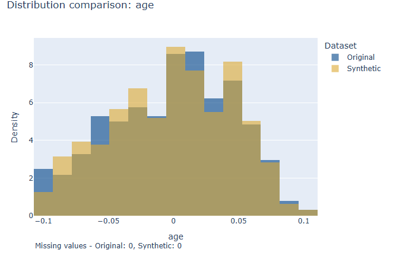
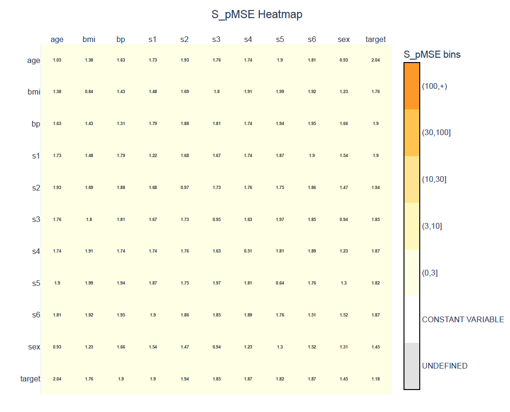

# Your first synthetic dataset

Welcome to synthpop-py. In this example, you'll learn the complete workflow for creating a synthetic dataset. We begin with an existing dataset: the [diabetes dataset](https://scikit-learn.org/stable/datasets/toy_dataset.html#diabetes-dataset) from `scikit-learn` and walk through the basic workflow:

1. Load the original data.
2. Create a `Synthesiser`.
3. Fit the Synthesiser to the original data.
4. Generate synthetic data.
5. Evaluate the utility of the synthetic data by comparing marginal distributions and pairwise relationships.

## Loading the data

We begin with an existing dataset. The diabetes dataset contains measurements from diabetes patients and a target variable representing disease progression. The dataset contains only continuous variables.

First, we load the dataset and convert it to a pandas DataFrame.

```python
from sklearn.datasets import load_diabetes

diabetes = load_diabetes(as_frame=True)
data = diabetes.frame

data.head(3)
```

The first three rows of the dataset are:

|   |         age |        sex |        bmi |          bp |          s1 |         s2 |         s3 |          s4 |         s5 |         s6 | target |
| -: | ----------: | ---------: | ---------: | ----------: | ----------: | ---------: | ---------: | ----------: | ---------: | ---------: | -----: |
| 0 |   0.0380759 |  0.0506801 |  0.0616962 |   0.0218724 |  -0.0442235 | -0.0348208 | -0.0434008 | -0.00259226 |  0.0199075 | -0.0176461 |    151 |
| 1 | -0.00188202 | -0.0446416 | -0.0514741 |  -0.0263275 | -0.00844872 | -0.0191633 |  0.0744116 |  -0.0394934 | -0.0683315 |  -0.092204 |     75 |
| 2 |   0.0852989 |  0.0506801 |  0.0444512 | -0.00567042 |  -0.0455995 | -0.0341945 | -0.0323559 | -0.00259226 | 0.00286131 | -0.0259303 |    141 |

Each row represents one observation in the original dataset. Our goal is generate a new dataset with the same structure, but containing synthetic data instead of the original data.

## Creating a synthesiser

Now we create a {class}`~synthpop.synthesiser.Synthesiser` object.

```python
from synthpop.synthesiser import Synthesiser

synthesiser = Synthesiser(random_seed=1)
```

The Synthesiser controls the complete synthesis process. During fitting, it learns patterns from the original data, such as relationships between variables and the distributions of individual columns.

At this stage, no synthetic data has been created yet. We have only configured the object that will perform the synthesis.

More information about initialising the Synthesiser can be found in {ref}`User Guide 2.2: The Synthesiser class <22-synthesiser-class>`.

## Fitting the Synthesiser

Next, we fit the Synthesiser on the original dataset.

```python
synthesiser.fit(data)
```

During fitting, synthpop-py analyses the variables and estimates the internal relationships between the data.

The default synthesis method is Classification and Regression Trees (CART). synthpop-py supports several synthesis methods, which can be configured and combined in different ways. These methods are covered in more detail in the [Synthesis methods examples](changing_the_default_method.md) and [User Guide 3: Synthesis methods](../user_guides/3_synthesis_methods.md).

The original data is not modified. Instead, the Synthesiser stores the information needed to create new observations.

More information about fitting the Synthesiser can be found in {ref}`User Guide 2.4: Fitting the synthesiser <24-fitting-synthesiser>`.

## Generating synthetic data

We can now generate a synthetic dataset.

```python
synthetic_data = synthesiser.generate()

synthetic_data.head(3)
```

The generated dataset has the same columns as the original dataset:

|   |        age |        sex |         bmi |         bp |         s1 |         s2 |         s3 |          s4 |         s5 |         s6 | target |
| -: | ---------: | ---------: | ----------: | ---------: | ---------: | ---------: | ---------: | ----------: | ---------: | ---------: | -----: |
| 0 | 0.00175052 | -0.0446416 | -0.00405033 | 0.00810098 |  0.0218222 |  0.0412743 | -0.0434008 |    0.039106 | -0.0545396 | -0.0176461 |    128 |
| 1 |  0.0598711 |  0.0506801 |  -0.0212953 | 0.00465813 |  0.0644768 |  0.0494162 |  0.0302319 | -0.00259226 |  0.0383939 | -0.0052198 |    196 |
| 2 | -0.0817979 | -0.0446416 |  -0.0816528 | -0.0400989 | -0.0455994 | -0.0370128 |  0.0339135 |  -0.0394934 | -0.0891334 |  -0.092204 |     72 |

****Congratulations, you have created your first synthetic dataset!****
{width=25px}

The generated data are not copies of the original observations. Instead, they are newly generated values that aim to preserve the statistical properties and relationships present in the original data.

More information about generating synthetic data can be found in {ref}`User Guide 2.5: Generating synthetic data <25-generating-synthetic_data>`.

## Evaluating the synthetic data

### Comparing individual variable distributions

Creating synthetic data is only the first step. A synthetic dataset should also be evaluated to determine whether it is useful for its intended purpose. This step is called utility evaluation. Utility describes how well synthetic data preserve the statistical properties and analytical usefulness of the original data.

An important part of utility evaluation is checking whether individual variables have similar distributions in the original and synthetic datasets. The function {func}`~synthpop.plotting.plot_univariate.plot_univariate_distributions` creates histograms and bar plots that show you the marginal distributions of individual variables.

```python
from synthpop.plotting.plot_univariate import plot_univariate_distributions

figures = plot_univariate_distributions(
    orig_df=data,
    syn_df=synthetic_data,
    interactive=True # this automatically opens the plots in your default browser to scroll through
)
```

Running the code above opens the plots interactively. You will see that the first plot looks like:


As you can see, the marginal distributions overlap mostly. There are some small differences, but generally speaking, the synthesiser reproduced the variable correctly.

More information about plotting the univariate distributions can be found in {ref}`User Guide 7.1: Univariate distribution visualisation <71-univariate-distribution-visualisation>`.

### Evaluating pairwise relationships with S_pMSE

Another important aspect of utility is whether relationships between variables are preserved. `synthpop-py` provides the pairwise Standardised propensity Mean Squared Error (S_pMSE) metric ({func}`~synthpop.utility_metrics.spmse.pairwise_spmse`) for this purpose.

```python
from synthpop.utility_metrics.spmse import pairwise_spmse

spmse = pairwise_spmse(
    orig_df=data,
    syn_df=synthetic_data
)

spmse.head(3)
```

The output contains the S_pMSE values for each pair of variables:

|   | column1 | column2 |  S_pMSE |
| -: | :------ | :------ | ------: |
| 0 | age     | age     | 1.02676 |
| 1 | age     | sex     | 0.92953 |
| 2 | age     | bmi     | 1.38183 |

Lower S_pMSE values indicate that the relationship between two variables is better preserved in the synthetic data. The interpretation of S_pMSE values and its limitations are explained in {ref}`User Guide 5.3.1: S_pMSE <531-spmse>`.

To make the results easier to inspect, we can visualise the S_pMSE values as a heatmap:

```python
from synthpop.plotting.plot_spmse import plot_spmse

plot = plot_spmse(spmse, show_plot=True)
```


These visualisations allow us to compare variables one by one. As seen in the plot, all S_pMSE values are below 3 which suggests that there is no statistical significant difference between the synthetic and original dataset with respect to the relationship between pairs of variables.

More information about this visualisation and the interpretation can be found in {ref}`User Guide 7.2: S_pMSE heatmap <72-spmse-heatmap>`.

## Next steps

Congratulations, you have created and evaluated your first synthetic dataset.
Check out the next examples in this module to discover:

- [how to make your synthesis reproducible](./reproducible_synthesis.md);
- [how to generate larger datasets](./generating_a_larger_dataset.md); and
- [the importance of the synthesis order](./changing_the_synthesis_order.md).

[The next module](changing_the_default_method.md) will teach you how to use different synthesis methods.
