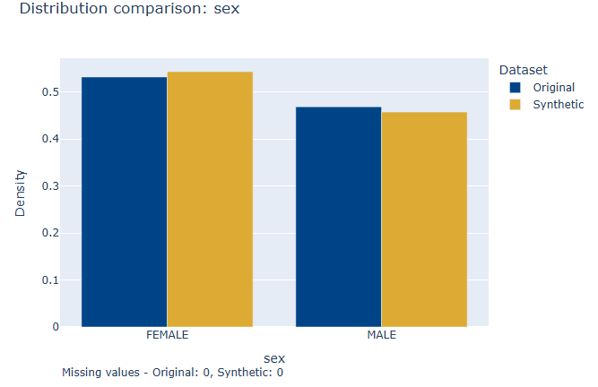
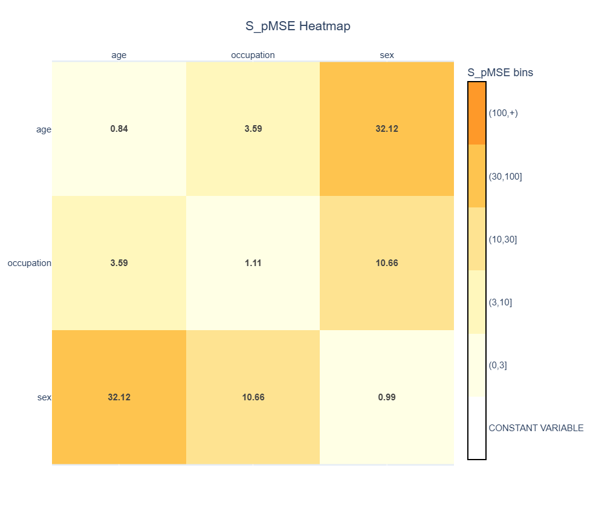

# 7. Visualisations
Synthetic data should be evaluated both quantitatively and visually. Quantitative metrics provide numerical measures of similarity between original and synthetic data, while visualisations provide an intuitive way to inspect whether important characteristics of the original data have been preserved.

The `synthpop-py` package provides visualisations for assessing utility by comparing the original and synthetic datasets:
- **Univariate distribution visualisation** compares the distribution of individual variables.
- **S_pMSE heatmap visualisation** provides an overview of pairwise relationships between variables using the S_pMSE values calculated by {func}`~synthpop.utility_metrics.spmse.pairwise_spmse` (see {ref}`Guide 5.3.1: S_pMSE <531-spmse>`).

The visualisation functions create interactive `plotly` figures.

The visualisations can help identify patterns, deviations or potential issues that require further investigation.

Small differences between original and synthetic data are expected because synthetic data is generated through a stochastic process. The goal is not to reproduce the original dataset exactly, but to preserve its relevant statistical properties.

---

(71-univariate-distribution-visualisation)=
## 7.1. Univariate distribution visualisation
The univariate distribution visualisation compares each variable in the original and synthetic datasets independently. It is generated using {func}`~synthpop.plotting.plot_univariate.plot_univariate_distributions`.
```python
from synthpop.plotting import plot_univariate_distributions

plots = plot_univariate_distributions(
    original_data, 
    synthetic_data,
    save_path=None,
    interactive=False)

plots[0].show()
```
For each variable:
- Numeric variables are displayed using overlapping density histograms.
- Categorical variables are displayed using relative-frequency bar charts.
- Missing values are included in the comparison and displayed separately.

The comparison allows users to inspect whether the synthetic data preserves important characteristics of individual variables, such as:
- central tendency,
- spread,
- skewness,
- category proportions,
- presence and frequency of missing values.

For the complete function signature, including options for saving and
interactive display, see
{func}`~synthpop.plotting.plot_univariate.plot_univariate_distributions`.

Large deviations between the original and synthetic distributions may indicate that the synthesis method has not adequately captured the distribution of a variable.

Depending on the synthesis method, small deviations are expected due to sampling variation. They are generally not problematic.

### 7.1.1. Numeric variables

For numeric variables, the visualisation displays overlapping histograms of the original and synthetic distributions.

The histograms are normalised as densities, allowing datasets with different numbers of observations to be compared directly.

When interpreting numeric distributions, consider:
- whether the overall shape of the distribution is preserved;
- whether the peaks and modes occur in similar locations;
- whether the spread and range are comparable;
- whether extreme values are preserved appropriately.

Potential issues include:
- missing peaks or additional peaks in the synthetic distribution;
- substantially different ranges;
- unrealistic extreme values;
- large differences in skewness or variability.

### 7.1.2. Categorical variables

For categorical variables, the visualisation displays the relative frequency of each category in the original and synthetic datasets. This allows datasets with different numbers of observations to be compared directly.

Categories occurring in only one of the datasets are also shown, allowing users to identify categories that were lost or introduced during synthesis.

When interpreting categorical distributions, consider:
- whether common categories have similar frequencies;
- whether rare categories are preserved;
- whether new categories appear unexpectedly;
- whether missing values occur with comparable frequency.

Potential issues include:
- categories disappearing entirely from synthetic data;
- rare categories being overrepresented or underrepresented;
- substantially different proportions between datasets.

### 7.1.3. Saving visualisations
The `save_path` parameter specifies the directory where the visualisation output is stored. The output is saved as an interactive HTML file:
```python
plot_univariate_distributions(
    original_data,
    synthetic_data,
    save_path="results"
)
```
This creates:
```text
results/univariate_distributions_comparison.html
```
The HTML file can be opened in a web browser and retains the interactive `plotly` functionality. If you do not wish to save the visualisations, set `save_path=None` (default).

### 7.1.4. Interactive display
The `interactive` parameter controls whether the generated HTML visualisation is automatically opened in the default web browser.
```python
plot_univarate_distributions(
    original_data,
    synthetic_data,
    interactive=True
)
```
When `interactive=True`, synthpop-py creates an HTML document containing all univariate distribution plots and opens it in the system's default browser. This provides a convenient way to browse and interact with all visualisations. If `save_plot=None`, a temporary file is created that will be opened, otherwise the saved file is opened.

When `interactive=False` (default), the HTML document is not opened automatically and the figures are not rendered. The function simply returns the list of Plotly figures. This is recommended when running in headless environments without graphical interfaces. If `save_path` is specified, the HTML file is still written to disk and can be opened manually later.

---

(72-spmse-heatmap)=
## 7.2. S_pMSE heatmap

The S_pMSE heatmap provides a visual representation of pairwise utility evaluation. It is generated using
{func}`~synthpop.plotting.plot_spmse.plot_spmse`.
The input is the pairwise S_pMSE table produced by
{func}`~synthpop.utility_metrics.spmse.pairwise_spmse`.
```python
from synthpop.utility_metrics.spmse import pairwise_spmse
from synthpop.plotting import plot_spmse

spmse = pairwise_spmse(original_data, synthetic_data)

fig = plot_spmse(
    spmse,
    save_path = None,
    show_plot = True
)
```

The underlying metric is the pairwise Standardised Propensity Mean Squared Error (S_pMSE), which measures differences between the joint distributions of pairs of variables in the original and synthetic datasets.

For the complete function signature, including options for saving and
rendering, see
{func}`~synthpop.plotting.plot_spmse.plot_spmse`.

The calculation of S_pMSE is described in the {ref}`utility evaluation guide <531-spmse>`. The heatmap uses the calculated S_pMSE values to provide an overview of how well relationships between variables are preserved.

Each cell represents the S_pMSE value for a pair of variables:
- diagonal cells represent individual variable comparisons;
- off-diagonal cells represent pairwise relationships between variables.

A higher S_pMSE value, shown with a darker shade, indicates a larger difference between the original and synthetic relationship.

### 7.2.1. Interpretation
The interpretation of S_pmSE values depends on characteristics such as dataset size, dimensionality and the number of possible category combinations. Therefore, the ranges below should be considered practical guidelines rather than universal thresholds.

| S_pMSE range | Interpretation |
|---|---|
| 0–3 | The synthetic and original data are not statistically distinguishable with respect to the relationship between the two variables. |
| 3–10 | The synthetic data is statistically distinguishable from the original data with respect to the relationship between the two variables. However, the difference is small and is generally considered acceptable. |
| 10–30 | The relationship between the two variables differs between the synthetic and original data, but the relationships are still of a similar order of magnitude. A small proportion of variable pairs may fall within this range. Verification of these relationships is recommended. |
| 30–100 | There is a substantial difference in the relationship between the two variables in the synthetic and original data. The relationship may still be partially preserved, but verification is essential for variable pairs in this range. |
| >100 | The synthetic data has not adequately captured the relationship between the two variables. The synthetic relationship should not be considered reliable without further investigation. |
| Constant variable | The S_pMSE cannot be meaningfully interpreted because the combination of the two variables is constant. The statistic is undefined for this case and is represented separately in the visualisation. |

The heatmap groups S_pMSE values into these ranges to make patterns easier to identify.

### 7.2.2. Saving the visualisation
The `save_path` parameter specifies the directory where the visualisation output is stored. The image is stored as a pdf.
```python
plot_spmse(
    spmse,
    save_path="results"
)
```
This creates:
```text
results/spmse.pdf
```
If you do not wish to save the visualisation, set `save_path=None` (default).

### 7.2.3. Displaying plot
The `show_plot` parameter controls whether the heatmap is displayed immediately.
```python
plot_spmse(
    spmse,
    show_plot=True
)
```
When `show_plot=True` (default), the plot is displayed using the active `plotly` renderer. The exact behaviour depends on the environment in which the code is executed:
- **Jupyter Notebook / JupyterLab**: the figure is rendered directly below the code cell as an interactive Plotly visualisation.
- **Python scripts (`.py` files)**: the figure is opened using the configured Plotly renderer. Depending on the environment, this may open the plot in a web browser or another supported viewer.
- **Headless environments** (for example, remote servers without a graphical interface): set `show_plot=False` to prevent attempts to render the figure interactively. The returned Plotly figure object can still be saved or displayed later in a supported environment.